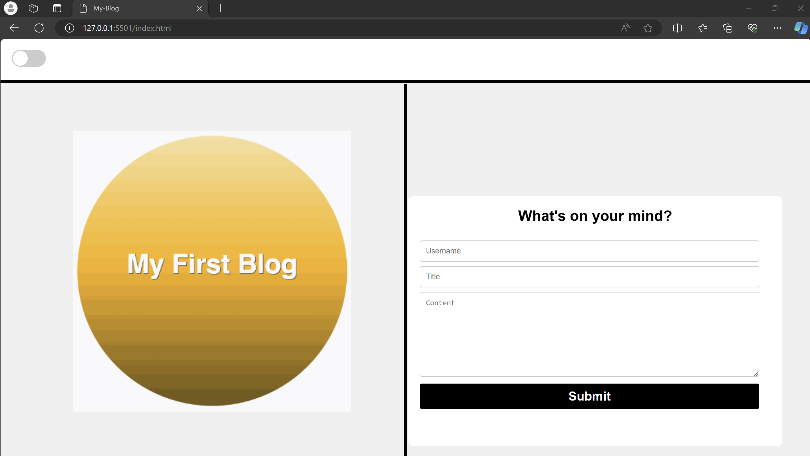
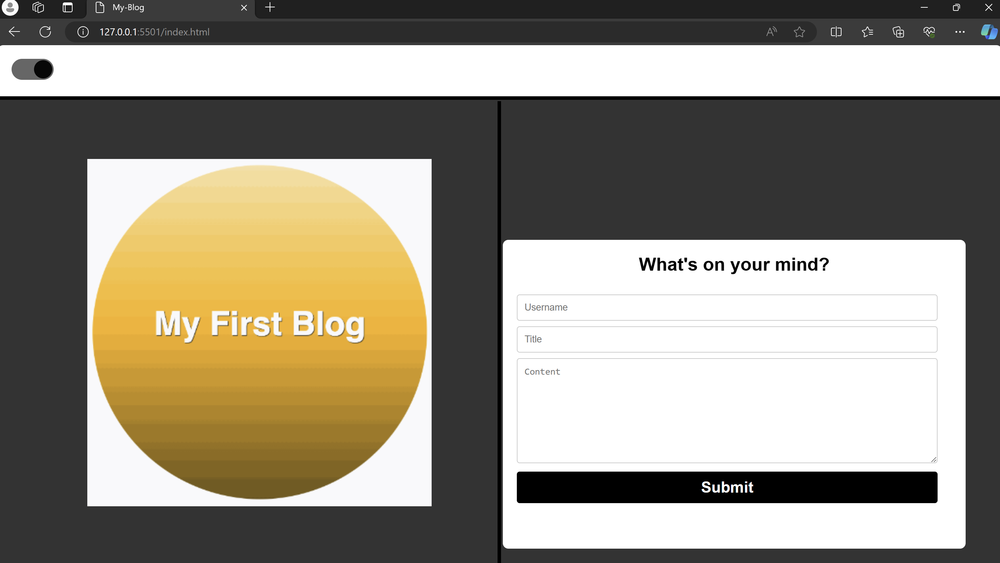
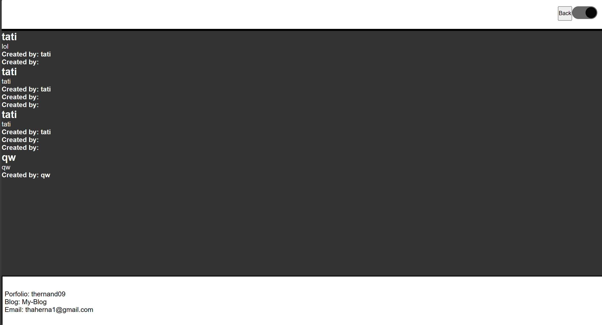

# My-Blog-Challange4

## User Story

```md
AS A marketing student,
I WANT a personal blog
SO THAT I can showcase my thoughts and experiences.
```

## Acceptance Criteria

```md
GIVEN a personal blog
WHEN I load the app,
THEN I am presented with the landing page containing a form with labels and inputs for username, blog title, and blog content.
WHEN I submit the form,
THEN blog post data is stored to localStorage.
WHEN the form submits,
THEN I am redirected to the posts page.
WHEN I enter try to submit a form without a username, title, or content,
THEN I am presented with a message that prompts me to complete the form.
WHEN I view the posts page,
THEN I am presented with a header, with a light mode/dark mode toggle, and a "Back" button.
WHEN I click the light mode/dark mode toggle,
THEN the page content's styles update to reflect the selection.
WHEN I click the "Back" button,
THEN I am redirected back to the landing page where I can input more blog entries.
WHEN I view the main content,
THEN I am presented with a list of blog posts that are pulled from localStorage.
WHEN I view localStorage,
THEN I am presented with a JSON array of blog post objects, each including the post author's username, title of the post, and post's content.
WHEN I take a closer look at a single blog entry in the list,
THEN I can see the title, the content, and the author of the post.
WHEN I view the footer,
THEN I am presented with a link to the developer's portfolio.
```

## Usage
Link for repo: https://github.com/thernand09/My-Blog-Challange4
Link for My-blog: gihttps://thernand09.github.io/My-Blog-Challange4/

## Tryouts

When switching toggle the website will turn on dark mode
    This will swith the background color by adding function in logic.js folder

When filling out the form and clicking submit the information will display in blog.html page
    This function is by adding functions to both form.js and blog.js

If form is left empty a window will appear displaying that form must be filled out

When clicking submit on form the page will then be directed to blog.html
When clicking on back buttom this will take you back to index.html displaying main page for My-Blog

## Screenshots




